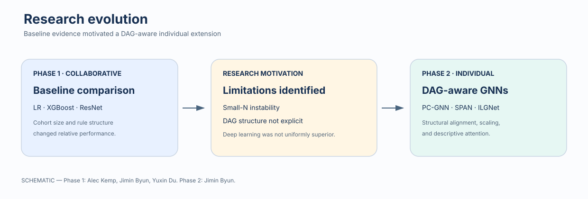

# Life-course epidemiology: baselines to graph neural networks

This research portfolio presents a two-phase progression from a collaborative benchmark study to Jimin Byun's individual graph-neural-network extension.



## Research progression

**Phase 1 — collaborative baseline study.** Alec Kemp, Jimin Byun, and Yuxin Du developed the group project comparing Logistic Regression, XGBoost, and ResNet across simulated sample sizes and life-course rules. Within that collaboration, Jimin led implementation, experiment execution, result generation, and analysis. This leadership attribution does not imply sole ownership of the group work.

**Phase 2 — individual GNN extension.** Jimin independently extended the research direction with the proposed PC-GNN, SPAN, and ILGNet model families. The original plotting code maps these portfolio names to `EconomicGNN_CNN`, `WeightedGAT_LSTM`, and `SpatioTemporalGNN`, respectively; raw result labels remain unchanged for traceability.

## Project at a glance

| Dimension | Phase 1: baseline study | Phase 2: GNN extension |
|---|---|---|
| Data | Synthetic longitudinal data from a `simcausal` DAG | Same nine-node longitudinal design plus exported graph edges |
| Structure | 9 variables × 40 time points | 9 graph nodes × 40 time points |
| Life-course rules | Order, repeated exposure, timing, and sensitive/critical/weighted period rules | 14 named rules: 3 Order, 3 Repeats, 4 Timing, 4 Period |
| Sample sizes in code | 500, 1,000, 2,000, 5,000, 10,000, 20,000 | 500–20,000 across experiment revisions; canonical compact summary uses complete N=500/1,000/2,000 results |
| Models | Logistic Regression, XGBoost, ResNet | PC-GNN (`EconomicGNN_CNN`), SPAN (`WeightedGAT_LSTM`), ILGNet (`SpatioTemporalGNN`), plus historical prototypes |
| Metrics | AUC/AUROC, F1, Brier score, recall/TPR, FPR, training time in code | AUROC, F1, optimal threshold, Brier score, positive rate, training time; attention-derived node importance |
| Evidence committed | Source and analysis pipeline; no Phase 1 metric output was uploaded | Raw CSV outputs, compact summaries, and attention-derived node-importance tables |

## Evidence-backed results

The committed plots below are generated only from uploaded CSV files. They do not claim uncertainty estimates because the uploads do not include replicate identifiers or confidence intervals.

| View | Evidence |
|---|---|
| [Performance across sample sizes](assets/performance-across-sample-sizes.svg) | Mean AUROC over 14 rules from the complete N=500/1,000/2,000 V4 table |
| [Performance by rule family](assets/performance-by-rule-family.svg) | Mean AUROC grouped into Order, Period, Repeats, and Timing families |
| [Attention/node importance](assets/node-importance.svg) | Uploaded WeightedGAT attention-derived node-importance summaries; N=1,000 is partial |
| [GNN architecture](assets/span-gnn-architecture.svg) | Clearly labelled schematic, not a measured result |

Machine-readable aggregates live in [`results/`](results/). Raw uploaded outputs remain under [`phase-2-gnn-extension/results/raw/`](phase-2-gnn-extension/results/raw/).

## Repository map

- [`phase-1-baseline-study/`](phase-1-baseline-study/) — collaborative benchmark source, scripts, and provenance.
- [`phase-2-gnn-extension/`](phase-2-gnn-extension/) — Jimin's individual GNN prototypes, raw results, and historical variants.
- [`assets/`](assets/) — committed SVG figures.
- [`results/`](results/) — compact, machine-readable result summaries.
- [`reports/`](reports/) — result provenance, filename audit, and limitations.
- [`docs/`](docs/) — original-upload checksums and archive map.
- [`tests/`](tests/) — deterministic, dependency-light integrity tests.

## Reproduce the portfolio layer

The smoke path uses only the Python standard library:

```bash
python3 scripts/build_portfolio_assets.py --check
python3 scripts/smoke_test.py
python3 -m unittest discover -s tests -v
```

Full model training requires the phase-specific environments and the generated `.npy` datasets, which were not part of the upload. See [`reports/reproducibility-limitations.md`](reports/reproducibility-limitations.md).

## Preservation

The rebuild starts from remote `main` commit `06a9c193d85b655bb82a9224bbd1086777dd9755`. Every uploaded path and SHA-256 digest is recorded in [`docs/original-file-manifest.sha256`](docs/original-file-manifest.sha256); exact originals are recoverable from that Git commit.
