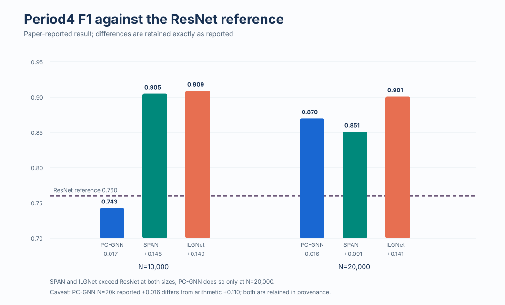
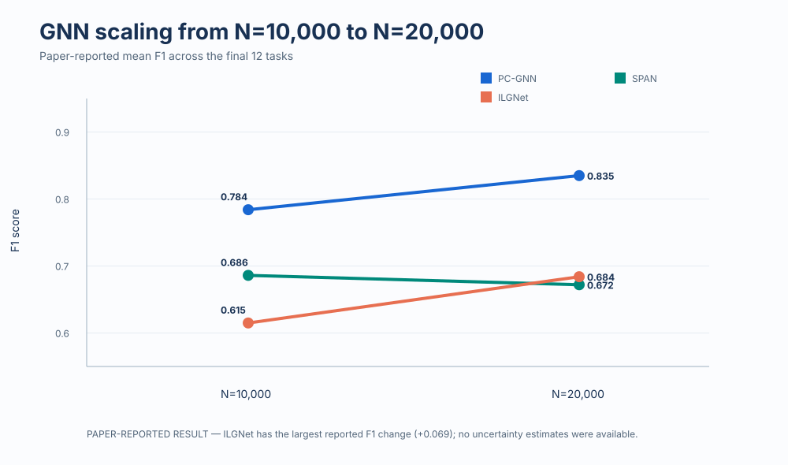
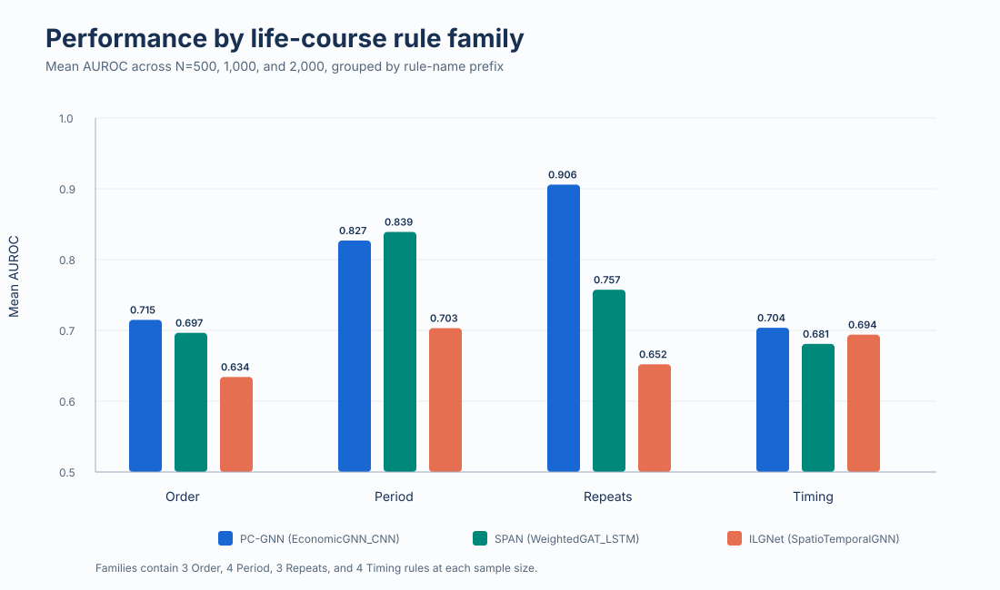

# Life-course epidemiology: from baselines to graph neural networks

**Research question:** how do cohort size, life-course rule structure, and explicit DAG inductive bias affect predictive performance in simulated longitudinal epidemiology?


## Key findings

- **ResNet remained strongest overall:** the final individual paper reports mean F1 of 0.954 for ResNet, versus 0.809 for PC-GNN, 0.679 for SPAN, and 0.649 for ILGNet.
- **Performance depended on the task:** across the final 12 rules, the broad GNN pattern was Period > Repeats > Timing > Order. This descriptive pattern is consistent with—but does not prove—better alignment between graph message passing and some rule structures.
- **Period4 was the clearest structural advantage:** SPAN and ILGNet exceeded the ResNet reference at both N=10,000 and N=20,000; PC-GNN did so at N=20,000 but not N=10,000. The largest paper-reported improvement was +0.149 F1 for ILGNet at N=10,000.
- **Scaling differed by architecture:** ILGNet showed the strongest paper-reported F1 change from N=10,000 to N=20,000 (+0.069), followed by PC-GNN (+0.051); SPAN changed by -0.015.
- **Phase 1 motivated Phase 2:** the collaborative baseline study found that deep learning was not uniformly superior at limited sample sizes and did not explicitly use the simulated causal DAG.

All headline values above are labelled **paper-reported results**. Uploaded raw rows and portfolio-derived aggregates remain separate in [`results/`](results/) and [`reports/result-provenance.md`](reports/result-provenance.md).

## Phase 1 vs Phase 2

| | Phase 1 — collaborative baseline | Phase 2 — Jimin Byun's individual extension |
|---|---|---|
| Data | Synthetic longitudinal cohort from a `simcausal` DAG | Same nine-node longitudinal design with exported graph edges |
| Life-course rules | Order, repeated exposure, timing, and period mechanisms | **Final paper:** 12 tasks: Order1–3, Repeats1–3, Timing1–3, Period1, Period2, Period4 |
| Sample sizes | 500, 1,000, 2,000, 5,000, 10,000, 20,000 in code | 500–20,000 across revisions; final headline comparisons use N=10,000 and N=20,000 |
| Models | Logistic Regression, XGBoost, ResNet | PC-GNN, SPAN, ILGNet; legacy implementation labels remain distinct |
| Metrics | AUC/AUROC, F1, Brier, TPR/FPR, runtime in code | AUROC, F1, Brier, threshold, prevalence, runtime, attention-derived importance |
| Main lesson | Model ranking changes with N and rule structure | ResNet leads overall; GNN advantages appear on selected structurally aligned tasks |
| Evidence status | Paper-reported result; Phase 1 metric files were not uploaded | Paper-reported tables plus uploaded raw CSV revisions and derived summaries |

## Period4 highlight



The paper reports a ResNet reference F1 of 0.760. One source inconsistency is retained transparently: PC-GNN at N=20,000 is reported as F1 0.870 and difference +0.016, although those displayed values imply +0.110. The repository does not silently alter either reported value; see [`reports/result-provenance.md`](reports/result-provenance.md).

## Large-N scaling



These are paper-reported final-12-rule means. The rounded values reconcile with the uploaded large-N V4 revision, but remain labelled paper-reported rather than replacing the raw evidence.

## Rule-family result



This chart is a portfolio-derived mean F1 from the uploaded large-N raw CSV after applying the final 12-rule filter. There are no replicate IDs or confidence intervals, so it supports descriptive comparison only.

## SPAN architecture and attention


[Attention-derived node importance](assets/node-importance.svg) is also retained with explicit coverage caveats. Attention describes model weighting; it is not evidence of causality. SHAP, perturbation analysis, or independent attribution comparisons would be needed for stronger interpretation.

## Authorship and contribution

**Phase 1 is collaborative work by Alec Kemp, Jimin Byun, and Yuxin Du.** Jimin led practical implementation, experiment execution, production of results, and data analysis, without claiming sole ownership of the group project.

**Phase 2 is Jimin Byun's individual project**, extending the baseline study toward DAG-aware GNNs. Paper model names are kept separate from legacy class/result labels because the ILGNet implementation identity is not fully resolved; see [`reports/model-identity-audit.md`](reports/model-identity-audit.md).

## Repository map

- [`phase-1-baseline-study/`](phase-1-baseline-study/) — collaborative source, scripts, and paper-reported findings.
- [`phase-2-gnn-extension/`](phase-2-gnn-extension/) — individual GNN source, raw results, and historical variants.
- [`results/`](results/) — paper-reported tables, the final-12-rule view, and raw-derived aggregates.
- [`assets/`](assets/) — committed evidence-labelled SVGs.
- [`reports/`](reports/) — result provenance, model identity audit, and limitations.
- [`docs/`](docs/) — original-upload checksum manifest and archive map.
- [`tests/`](tests/) — deterministic integrity and runner regression checks.

## Reproduction

The dependency-light portfolio layer is deterministic:

```bash
python3 scripts/build_portfolio_assets.py --check
python3 scripts/smoke_test.py
python3 -m unittest discover -s tests -v
```

Full training requires the phase-specific environment plus generated `.npy` datasets:

```bash
conda env create -f phase-2-gnn-extension/environment.yml
conda activate lce-gnn
PYTHONPATH=phase-2-gnn-extension/src \
  python phase-2-gnn-extension/scripts/experiments/run_temporal_experiments.py
```

## Scientific and reproducibility limitations

The study uses synthetic data; Phase 1 result files, generated datasets, checkpoints, replicate/fold IDs, and uncertainty estimates are unavailable. Raw experiment revisions overlap without a definitive run registry, and the ILGNet code identity remains ambiguous. See [`reports/reproducibility-limitations.md`](reports/reproducibility-limitations.md) for the full boundary of support.

Every originally uploaded path is recoverable from source commit `06a9c193d85b655bb82a9224bbd1086777dd9755` and recorded in [`docs/original-file-manifest.sha256`](docs/original-file-manifest.sha256).
