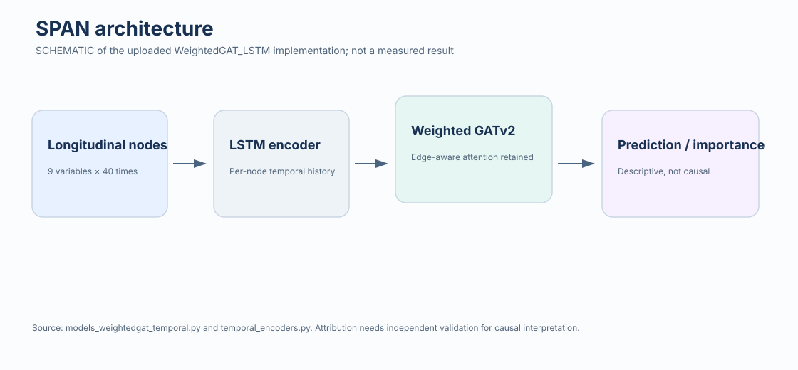

# Phase 2 — Jimin Byun's individual GNN extension

This phase is Jimin Byun's individual extension of the collaborative baseline research. It proposes three portfolio-facing model families while preserving the uploaded implementation and result names:

| Proposal | Uploaded implementation/result label | Core idea evidenced in code |
|---|---|---|
| PC-GNN | `EconomicGNN_CNN` | DAG-aware graph convolution/attention with a CNN temporal encoder |
| SPAN | `WeightedGAT_LSTM` | Edge-weight-aware GATv2 attention with an LSTM temporal encoder |
| ILGNet | `SpatioTemporalGNN` | Joint temporal self-attention, graph cross-attention, GAT message passing, and fusion |

This mapping is retained from the uploaded `plot_results.py`. It is presentation nomenclature, not a claim that the raw CSVs originally used those names.



## Layout

- `src/lce_gnn/` — cleaned importable model package.
- `scripts/data/` — the uploaded 12-rule DAG exporter plus a separately traced 14-rule generator mapping.
- `scripts/experiments/` — active temporal experiment runner.
- `scripts/analysis/` — plotting, hyperparameter, and attention-analysis tools.
- `config/` — N-adaptive hyperparameter configuration.
- `results/raw/` — uploaded result CSVs and the uploaded empty log, unchanged except for relocation.
- `historical/` — traced prototype variants that are not the active implementation.

## Results used by the portfolio

`final_model_comparison_metrics_V4_N500_1000_2000.csv` is the canonical compact comparison because it is a complete 3 sample-size × 14 rule × 3 model grid (126 rows). Other raw tables are retained as separate experiment revisions rather than merged.

The node-importance visual combines the N=500, N=1,000, and N=2,000 summaries. The N=1,000 upload contains only two rules, so the visual and summary explicitly mark that sample as partial.

## Environment and run outline

```bash
conda env create -f environment.yml
conda activate lce-gnn
PYTHONPATH=src python scripts/experiments/run_temporal_experiments.py
```

Full execution additionally requires generated DAG/data files and is not exercised in CI. CI instead compiles the code and validates the committed evidence deterministically.

The two uploaded R generators disagree on two rule mappings. `generate_simulated_data_and_dag.R` exports the DAG but lists 12 rules; `generate_all_14_rules_legacy_mapping.R` lists 14 rules with a different mapping. They remain separate pending scientific confirmation rather than being silently combined.
